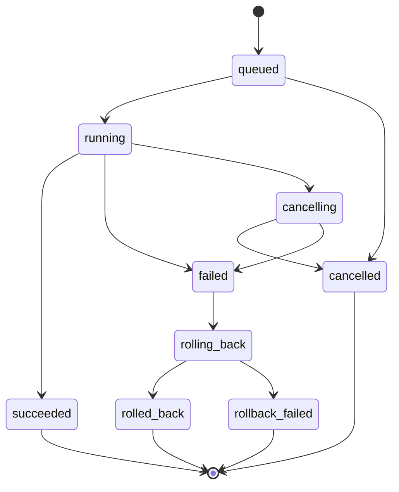
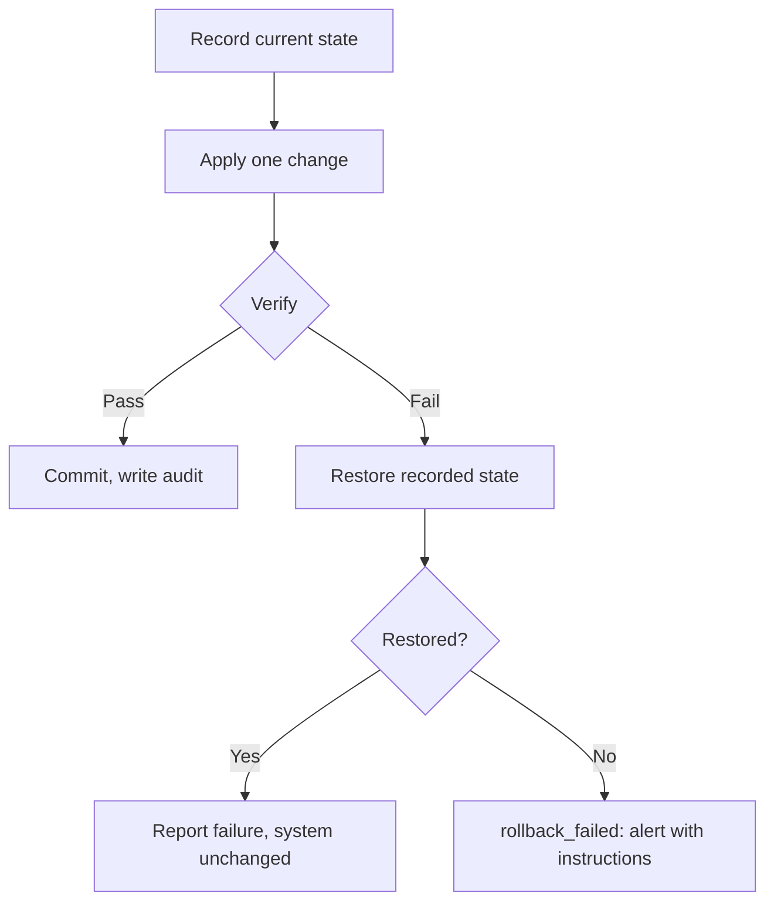

# Jobs

Installing an application takes minutes. Running a backup can take hours. Mounting a disk
usually takes a moment, and occasionally hangs forever because the disk is dying.

None of these are ordinary HTTP requests, and pretending otherwise produces the failure mode
every self-hosted tool has: a spinner, a gateway timeout, and no way to tell whether the
thing you asked for is still happening.

## The model

A mutating operation returns immediately with a job:

```http
POST /api/v1/apps/jellyfin/install
```

```json
{
  "job_id": "job_01HQ8X2K3M",
  "state": "queued",
  "created_at": "2026-08-06T14:22:31Z"
}
```

The client then observes it:

```json
{
  "job_id": "job_01HQ8X2K3M",
  "state": "running",
  "stage": "downloading_image",
  "progress": 65,
  "message": "Downloading Jellyfin (1.2 GB of 1.8 GB)",
  "started_at": "2026-08-06T14:22:32Z",
  "cancellable": true
}
```

`message` is written for the person reading it, not for the developer who wrote it. That is
a requirement, not a nicety — it is the difference between a server its owner can reason
about and one they have to ask somebody about.

## States



`rollback_failed` is a terminal state and the worst one: the operation failed *and* the
attempt to undo it failed, so the system is in a state nobody designed. It always produces a
user-visible alert with specific recovery instructions. It is never retried automatically —
an automatic retry against an unknown state is how a bad situation becomes an unrecoverable
one.

## What every job must provide

| Property | Why |
|---|---|
| **Progress** | Not a spinner. Stage plus percentage where it is knowable, stage alone where it is not. |
| **Cancellation** | Where safe. A job that cannot be cancelled says so, so the UI does not offer a button that does nothing. |
| **Structured logs** | Machine-readable events, not free text to be scraped later. |
| **Idempotency** | Submitting the same operation twice must not perform it twice. |
| **A reason for failure** | Which stage, what happened, and what the user can do. |
| **Recovery guidance** | "Reconnect the backup disk and run this again", not error code 17. |
| **Rollback** | Where the operation can be undone. Where it cannot, that is stated up front. |

### Idempotency

Mutating requests carry a client-supplied key:

```http
POST /api/v1/apps/jellyfin/install
Idempotency-Key: 7f3a9c21-4e8b-4d2a-9f1c-3b5e8d7a2f60
```

A repeated key returns the original job rather than starting a second one. This is not an
edge case: a user on flaky Wi-Fi will press "Install" twice, and two concurrent installs of
the same application is a genuinely bad outcome.

It matters more in Stage 2, where an automated operator that loses a connection mid-request
will retry — and must not thereby run a backup twice or restart a service in a loop.

## Transactions

Any job that changes system state follows the same shape:



**One change at a time.** A job that changes three things and fails on the third leaves two
changes behind and a rollback that has to reason about partial state. Sequence three
verified single-change transactions instead.

**Verify by observation, not assumption.** After changing DNS, resolve a name. After
mounting a disk, read a file. The command exiting zero is not evidence the intended outcome
occurred.

## Concurrency

Jobs declare the resources they touch, and jobs touching the same resource are serialised.
Installing two different applications proceeds in parallel; restarting Jellyfin while
Jellyfin is being upgraded does not.

Some jobs are exclusive across the whole system — applying a system update, restoring a
backup, reformatting a disk. These wait for everything else to finish and block new jobs
until they are done.

## Persistence

Jobs live in SQLite and survive a restart of `core`.

A job that was `running` when the machine stopped is resumed if it is resumable, and marked
`failed` with an honest message if it is not:

> Installing Jellyfin was interrupted when the server restarted. Nothing was left
> half-installed. You can try again.

The alternative — a job stuck at "running, 65 %" forever, with no process behind it — is
worse than a clear failure, because the user has no way to know the difference.

## Why this shape

The job system exists for the dashboard, but its shape is chosen for Stage 2.

An AI operator needs exactly what a good UI needs, and needs it more: to know whether an
action is still in progress, to observe outcomes rather than assume them, to retry safely, to
undo what it did, and to leave a record of all of it. A system where "restart Jellyfin"
returns 200 and nothing else offers a model no way to tell success from silence.

Every job is therefore already an auditable, reversible, observable transaction before any
model exists to invoke one. That is the whole reason this is Milestone 2 work rather than a
Stage 2 concern.
