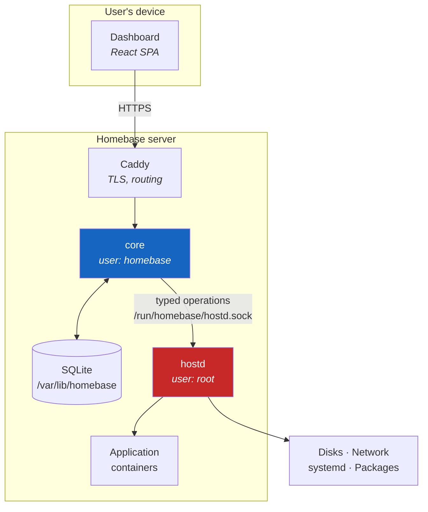

# Architecture overview

Homebase is three components separated by one privilege boundary, plus a job system that
makes changes observable and reversible.



The red box is the only thing running as root, and the arrow into it is the only way to
reach it.

## The components

### `core` — unprivileged

Runs as the `homebase` system user. Owns everything that does not require privilege:

- The HTTP API — the sole supported interface, versioned and documented in
  [`api/openapi.yaml`](https://github.com/HusnuOkanCakir/homebase/blob/main/api/openapi.yaml)
- Authentication, sessions and permission checks
- The [job system](jobs.md)
- Application metadata, catalogue, and installation state
- Events and audit history
- SQLite state in `/var/lib/homebase/`

`core` cannot mount a disk, start a container or change the network. When it needs one of
those things it asks `hostd`, and it asks by naming a specific operation.

### `hostd` — privileged, deliberately small

Runs as root, listening on a Unix socket at `/run/homebase/hostd.sock`. It accepts a fixed
set of named operations, each with a schema, a declared risk level, a timeout and — where
the operation can be undone — a rollback.

It has no operation that executes an arbitrary command, path or configuration fragment.

This is the constraint the whole design rests on, so it is worth being precise about what it
means. "Restart the container named `jellyfin`" is an operation. "Run `docker restart
jellyfin`" is not, and neither is "run this systemd unit file I generated for you". The
difference is whether the set of things that can happen is enumerable in advance.

`hostd` should stay small enough that one person can read all of it in an afternoon and
believe it. Every operation added makes that less true, which is why adding one requires
security review and a written justification for why a narrower operation would not do.

See [privilege boundaries](../security/privilege-boundaries.md) and
[ADR-0006](../decisions/0006-privilege-split.md).

### Dashboard — an ordinary client

A React single-page application. It authenticates like any client, is bounded by the signed-in
user's permissions, and talks only to the `core` API. It does not reach Docker, systemd or
the filesystem, and it holds no privilege of its own.

When the dashboard needs something the API cannot express, the fix is to add the capability
to the API — never to give the browser a side channel. Every shortcut taken here becomes a
hole in Stage 2, when a second, less predictable client starts using the same surface.

## Data flow: restarting an application

```mermaid
sequenceDiagram
    participant U as User
    participant D as Dashboard
    participant C as core
    participant H as hostd
    participant R as Container runtime

    U->>D: Restart Jellyfin
    D->>C: POST /api/v1/apps/jellyfin/restart
    C->>C: Authenticate; check apps.manage
    C->>C: Create job, write audit event
    C-->>D: 202 { job_id }
    C->>H: app.restart { id: "jellyfin" }
    H->>H: Validate against schema; check risk policy
    H->>R: Stop, then start the container
    R-->>H: Running
    H-->>C: { state: "running", pid, started_at }
    C->>C: Health check, then complete the job
    D->>C: GET /api/v1/jobs/{id} (polling)
    C-->>D: { state: "succeeded" }
```

Four properties of this exchange matter more than the specific steps:

1. The dashboard receives `202` and a job id, not a blocked connection. Operations that take
   minutes must not be ordinary synchronous requests — see [jobs](jobs.md).
2. Authorisation happens in `core`, before `hostd` is contacted at all.
3. `hostd` validates independently. It does not assume `core` has already checked, because a
   compromised `core` is precisely the case the boundary exists for.
4. The audit event is written before the action, not after. An action that crashed the
   machine mid-way must still leave a record that it was attempted.

## Directory layout

Four locations, with different lifetimes and different backup treatment:

| Path | Contents | Survives reinstall |
|---|---|---|
| `/etc/homebase/` | Configuration | Restored from backup |
| `/var/lib/homebase/` | System state, SQLite database | Restored from backup |
| `/srv/homebase/` | User and application data | **Preserved in place** |
| `/var/log/homebase/` | Logs | No |

Applications cannot write outside their assigned directories under `/srv/homebase/`. Full
detail in [data layout](data-layout.md).

## What is deliberately absent

**No message broker, no microservices.** Two processes and a Unix socket. A home server
running on a ten-year-old laptop has no capacity to spare for infrastructure that exists to
solve scaling problems it will never have.

**No agent framework.** The Stage 2 AI operator is a client of this API, not a component of
this diagram. If it were a component, it would need privileges, and then the boundary would
be an illusion.

**No plugin system for privileged code.** Applications run in containers with declared
permissions. There is no mechanism for third-party code to extend `hostd`, because the value
of `hostd` is precisely that its complete behaviour is known in advance.

## Further reading

- [Services](services.md) — what each component may and may not do
- [Jobs](jobs.md) — long-running operations, progress, rollback
- [Data layout](data-layout.md) — the filesystem contract
- [API conventions](api-conventions.md) — versioning, errors, idempotency
- [Decision records](../decisions/index.md) — why, rather than what
