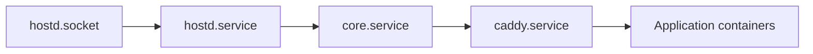

# Services

What each component may do, and — more usefully — what it may not.

The "must not" columns are the load-bearing half of this page. Architecture documents
usually describe responsibilities; the failures that matter here come from components
quietly acquiring capabilities nobody wrote down.

## `core`

Runs as the `homebase` system user under systemd. Listens on localhost; Caddy terminates TLS
in front of it.

### Responsibilities

| Area | Detail |
|---|---|
| API | Every endpoint in `api/openapi.yaml`. The only supported interface. |
| Authentication | Sessions, password hashing, first-run administrator setup |
| Authorisation | Permission checks, before any privileged operation is requested |
| Jobs | Queue, progress, cancellation, idempotency, rollback orchestration |
| Applications | Catalogue, manifests, installation state, health tracking |
| Events | Structured events and the audit log |
| State | SQLite in `/var/lib/homebase/`, and its migrations |
| Configuration | Reading `/etc/homebase/` |

### `core` must not

- **Run as root, or hold any capability.** If a feature seems to need this, it needs a new
  `hostd` operation instead.
- **Open the Docker socket.** Container operations go through `hostd`. A process that can
  talk to Docker is root by another name.
- **Write outside `/var/lib/homebase/` and `/srv/homebase/`.**
- **Store secrets in plaintext**, or return them through the API. Credentials are handed out
  as references — `credential_ref: "jellyfin-admin"` — and resolved at the point of use.
- **Log secrets**, including in error messages and diagnostic bundles.
- **Trust `hostd` to authorise.** Authorisation happens here. `hostd` validates
  independently, but that is defence in depth, not a division of labour.

## `hostd`

Runs as root under systemd, with the tightest sandbox that still allows its work. Listens on
`/run/homebase/hostd.sock`, owned `root:homebase`, mode `0660`.

### Responsibilities

Named operations, and nothing else:

| Domain | Examples |
|---|---|
| System | `system.get_info`, `system.get_resources`, `system.reboot` |
| Containers | `app.create`, `app.start`, `app.stop`, `app.restart`, `app.remove` |
| Storage | `storage.list_disks`, `storage.mount`, `storage.unmount`, `storage.format` |
| Network | `network.get_status`, `network.run_diagnostics`, `network.configure` |
| Updates | `update.check`, `update.apply`, `update.rollback` |
| Power | `power.set_lid_behaviour`, `power.inhibit_sleep` |

Each declares:

```yaml
name: storage.mount
risk: medium
permissions: [storage.modify]
confirmation: required
timeout: 30s
rollback: storage.unmount
audit: always
```

### `hostd` must not

- **Accept a command, a path, a shell fragment or a configuration file to execute.** Not
  behind a feature flag, not for debugging, not "temporarily". This is the boundary
  ([ADR-0006](../decisions/0006-privilege-split.md)).
- **Accept an operation name it does not recognise.** Unknown operations are rejected, never
  passed through.
- **Grow an operation that is more general than its caller needs.** `network.configure`
  taking a whole interface configuration is worse than three narrow operations, even though
  it is less code.
- **Skip schema validation** because `core` is trusted. `core` is the thing most likely to
  be compromised — it is the one talking to the network.
- **Perform an unaudited action.** Including read-only ones, which is how you reconstruct
  what an automated operator was looking at before it did something.
- **Depend on `core`.** `hostd` must start, run and be debuggable on its own — it is what
  you have left when `core` will not start.

### Why so restrictive

`hostd` is the component where a mistake is unrecoverable. Everything else fails into a
broken feature; this fails into a compromised machine holding somebody's photographs.

It is also the component the Stage 2 AI reaches, at several removes. A generic operation
here would mean the model's output eventually becomes a command — which is the exact design
the whole system is arranged to avoid.

## Dashboard

Static assets served by Caddy. All behaviour is API calls.

### Must not

- Assume privileges. Everything is bounded by the signed-in user's permissions.
- Contact anything but the `core` API — no Docker, no direct filesystem, no third-party
  telemetry, no external CDN. A home server must work with the internet unplugged.
- Enforce authorisation on its own. Hiding a button is a courtesy, not a control; the API
  rejects the request regardless.
- Show raw Linux errors. "Permission denied on /dev/sdb1" is a bug report, not a message to
  a person who wants their photographs back.

## Caddy

Reverse proxy and TLS. Terminates HTTPS, serves the dashboard, forwards `/api/` to `core`.

Kept deliberately dull: no authentication logic, no rewriting, no plugins. Configuration
generated by `core` and applied through `hostd`.

## Supporting services

| Service | Role |
|---|---|
| systemd | Process supervision, restart policy, sandboxing |
| Docker Engine | Container runtime, reached only via `hostd` ([ADR-0005](../decisions/0005-container-runtime.md)) |
| Avahi | mDNS, so the server is reachable by name |
| SQLite | Embedded state store ([ADR-0004](../decisions/0004-sqlite.md)) |

## Startup order



Socket activation means `core` can start before `hostd` is ready and its first request will
block rather than fail.

`core` failing to start must not prevent `hostd` from running: recovery tooling talks to
`hostd` directly, and the situation where you need it most is the one where `core` is broken.
