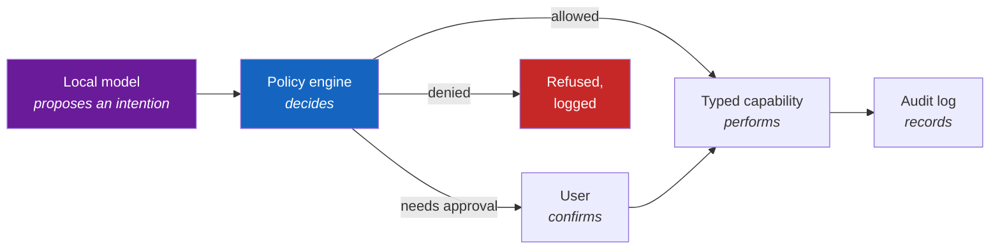

# ADR-0006: Unprivileged core, minimal hostd, no generic execution

- **Status:** Accepted
- **Date:** 2026-08-06

!!! danger "This record defines a boundary the project may not cross"

    Everything else here describes how Homebase is built. This describes what it is not
    permitted to become. Read it before proposing anything that touches `hostd`.

## Context

Homebase administers a machine. Mounting disks, starting containers, changing network
configuration, applying updates and rebooting all require root.

It also serves a web interface to a home network, and eventually intends to run a local
language model that administers the same machine on the user's behalf.

Those two facts sit badly together. The naive design — one service running as root, doing
everything — means the HTTP handler parsing a request from the network is running as root,
and later, the component turning a model's output into an action is also running as root.

The Stage 2 plan makes this concrete. A local AI operator will be asked "my internet is
broken, fix it", and will need to run diagnostics and change configuration. The tempting
implementation is to give the model a shell. Every prompt-injection failure in deployed AI
systems has the same shape: untrusted content reaches a component that can act, and the
component cannot distinguish instructions from data.

Homebase will ingest untrusted content constantly and unavoidably — filenames, media
metadata, application descriptions, catalogue entries, log lines produced by third-party
containers. There is no version of this system where the model only ever reads text the user
typed.

So the boundary has to be architectural. It cannot be a matter of prompting the model
carefully, because prompting is a mitigation and this needs a control.

## Decision

**Three rules.**

### 1. `core` is unprivileged

`core` runs as the `homebase` system user. It holds the API, authentication, jobs, state and
audit history. It has no capabilities, no root, and no access to the Docker socket.

Everything that touches the network runs here, unprivileged, deliberately.

### 2. `hostd` is privileged, minimal, and typed

`hostd` runs as root and listens on `/run/homebase/hostd.sock` (`root:homebase`, mode `0660`).
It accepts a **fixed, enumerable set of named operations**, each declaring:

```yaml
name: storage.mount
risk: medium
permissions: [storage.modify]
confirmation: required
timeout: 30s
rollback: storage.unmount
audit: always
```

Every request is validated against its schema before anything happens. Unknown operations are
rejected, never forwarded.

### 3. There is no generic execution operation

`hostd` **must not** accept, in any form:

- A command, argument vector or shell fragment to execute
- A file path to read or write, chosen by the caller
- A configuration file, systemd unit or container specification to apply verbatim
- An operation name resolved dynamically rather than from a compiled-in set
- A "run this Docker API call" passthrough

Not behind a flag. Not for development. Not temporarily.

The test is whether **the complete set of things that can happen is enumerable in advance**.
"Restart the container named `jellyfin`, where `jellyfin` is a known installed application"
is an operation. "Restart the container named `$X`" is not. "Apply this unit file" is not,
however well-validated the unit file is.

## The consequence for Stage 2

The AI operator is **a client of the `core` API**. It is not a component of the system, it
holds no privilege, and it has no path to `hostd` that the dashboard does not also have.



The model **proposes an intention**. The policy engine **decides**. A typed capability
**performs**. The audit log **records**. The model never decides whether something is allowed,
and never performs anything itself.

This holds even when the model is right and the policy engine is being obtuse. A design where
a sufficiently confident model can act directly is a design where a sufficiently
well-crafted filename can act directly.

## Alternatives considered

### One service, running as root

Simpler: no socket, no serialisation, no split. This is what most self-hosted management
tools do.

Rejected because it puts the HTTP handler — the component parsing input from the network —
in the same process as the code that can reformat a disk. Any request-handling bug becomes
root. And it makes Stage 2 unimplementable safely: the model's output would be interpreted by
a root process, with only prompting between a malicious filename and a destroyed disk.

### `sudo` with a restricted `sudoers` allowlist

The traditional Unix answer, and better than nothing.

Rejected because `sudoers` allowlists are notoriously difficult to make actually restrictive.
Argument matching is textual, wildcards are permissive in ways that are not obvious, and many
permitted binaries offer an escape to a shell. It also gives no schema validation, no
structured results, no rollback and no audit beyond "this command ran".

### A generic operation with strong validation

The pragmatic-sounding middle ground: `hostd` accepts a command, but validates it thoroughly
against an allowlist.

Rejected, and this is the one worth being firm about, because it is the alternative that will
be proposed again. Validation is a filter, and a filter is only as good as the imagination of
whoever wrote it. Once the interface accepts a string that becomes a command, the security
property depends on a parser being right about every input — including inputs invented after
the parser was written.

More practically: an interface that *can* express arbitrary commands will be used to express
them. The next feature that does not quite fit an existing operation will go through the
generic one, and in a year the typed operations will be a thin veneer over a shell.

The narrow-operation rule is annoying by design. That is what makes it hold.

### Polkit

The desktop Linux answer for privileged actions. Rejected as a poor fit for a headless
appliance: it assumes an interactive session for authentication, and the policy language is
awkward for the structured, rollback-capable operations needed here.

## Consequences

### What this makes easier

- A bug in request handling is a bug in an unprivileged process
- The complete privileged surface is a list, reviewable in one sitting
- Every privileged action is audited, schema-validated and — where possible — reversible
- The dashboard, the CLI and the AI are the same kind of thing: ordinary API clients
- Stage 2 can be built without the result being an LLM with root
- `hostd` can be reviewed on its own by someone deciding whether to trust it

### What this makes harder

- **Every privileged capability requires a new operation.** Adding a feature means designing
  an operation, schema, risk level, rollback and audit record. This is slower, and it is
  supposed to be
- Serialisation across a socket for things that would otherwise be a function call
- Debugging spans two processes and a protocol
- Genuinely novel administrative tasks may have no operation, and the answer will sometimes
  be "Homebase cannot do that yet" rather than a workaround
- The Stage 2 AI will be less capable than one with a shell — this is the trade being made,
  knowingly

### Security impact

The central control the architecture rests on.

What it defends against:

- A compromised `core` gets the operations `core` can already invoke — not a shell
- A malicious application cannot reach `hostd` at all; it has no socket access
- Prompt injection in Stage 2 reaches, at worst, the policy engine — where a typed proposal
  is evaluated on its own merits regardless of what prompted it
- Every privileged action is attributable

What it does not defend against, stated plainly:

- **A bug in `hostd` itself.** It is root; a memory-safety or logic flaw there is a full
  compromise. This is why it stays small, has few dependencies, and requires security review
- **A container escape.** Docker's daemon is root ([ADR-0005](0005-container-runtime.md))
- **A malicious operation being added.** The boundary is enforced by review, and review is
  people. `CODEOWNERS`, the `risk/security` label and this record are what make that review
  reliable rather than incidental
- **Socket permissions being widened in packaging.** Mode `0666` removes the boundary without
  touching any Go code, which is why `packaging/` requires security review

### What would make us revisit this

Nothing about rules 1 and 3. They are the premise the project is built on; a change would be
a different project.

Legitimate refinements to rule 2:

- Splitting `hostd` further, so that storage operations and network operations are separate
  processes with separate blast radii
- Moving from a Unix socket to a more capable IPC mechanism, if it improves auditing
- Adopting seccomp or Landlock to constrain `hostd` itself

Any proposal to relax rule 3 needs a new ADR that supersedes this one, and an explanation of
what changed about untrusted input reaching components that can act.

## See also

- [Privilege boundaries](../security/privilege-boundaries.md) — the operational detail
- [Threat model](../security/threat-model.md) — what this defends against
- [Services](../architecture/services.md) — what each component may not do
