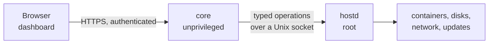

# Homebase

Turn an old laptop into a home server you can actually manage.

!!! warning "Pre-alpha — Milestones 0, 1 and 2 complete"

    There is no installable release yet — no installer. `hostd`, `core` and the dashboard
    work and install from Debian packages: you can set up an administrator, read live
    system information and restart the machine from a browser. There are no applications,
    no storage management and no backups.

    Much of what follows still describes intent rather than behaviour — everything from
    Milestone 3 onward. Where the documentation and the implementation eventually disagree,
    the documentation is the target and the gap is a bug. Nothing here should be pointed at
    data you care about.

## The idea

Most people have a laptop in a drawer that still works. It has a processor, several
gigabytes of memory and a disk — enough to run the handful of services a household actually
wants: somewhere to keep photographs, something to play films, a way to block adverts on
every device at once.

What stops them is not the hardware. It is that turning that laptop into a server currently
means installing Linux, learning containers, editing configuration files, and knowing what
to do when it stops working at 11pm.

Homebase is an attempt to remove all of that, without removing the parts that make a
self-hosted server worth having: your data stays on your hardware, on your network, and
nobody can switch it off or start charging for it.

## Principles

**Local first.** Everything works on your own network. No account, no cloud dependency, no
telemetry. Remote access is optional and private when you enable it.

**The appliance owns the machine.** Homebase installs by erasing a whole disk. That is a
serious thing to do, and it is why the installer asks more carefully than anything else in
the system. In exchange, it can make guarantees a "install this on your existing Linux box"
tool cannot.

**Failures should be legible.** Software fails. A server that fails in a way its owner can
understand — *the backup disk is unplugged* — is enormously more useful than one that fails
correctly but silently.

**Reversible by default.** Meaningful changes are jobs: previewed, applied, verified, and
rolled back if verification fails. This is not only for safety; it is what makes it possible
to hand any of it to an automated operator later.

**No root for convenience.** The dashboard has no privileges. Neither will the AI. Every
privileged action goes through a small, fixed set of reviewed operations.

## How it is built

Three components across one privilege boundary:

`core` holds the API, authentication, jobs and audit history, and runs as an ordinary user.
`hostd` runs as root and accepts only a fixed set of named, schema-validated operations —
there is no operation that runs an arbitrary command, and there never will be. See
[ADR-0006](decisions/0006-privilege-split.md).

## Where this is going

Stage 2 adds a **local AI operator**: a model running on the same machine, working without
an internet connection, that can answer "why is the internet slow?" and "is my backup
working?" — and, with permission, fix things.

That is the reason the privilege boundary above is drawn so firmly now. The AI is not
special. It is a second client of the same API the dashboard uses, and everything it does
passes through a policy engine that decides what is allowed, a typed capability that
performs it, and an audit log that records it.

Building the boundary first is the entire strategy. See the
[roadmap](https://github.com/HusnuOkanCakir/homebase/blob/main/ROADMAP.md).

## Start here

- :material-sitemap: **[Architecture overview](architecture/overview.md)**

    How the components fit together and why

- :material-scale-balance: **[Decision records](decisions/index.md)**

    Why things are the way they are

- :material-shield-lock: **[Threat model](security/threat-model.md)**

    What Homebase defends against, and what it does not

- :material-console: **[Getting started](development/getting-started.md)**

    Set up a development environment

