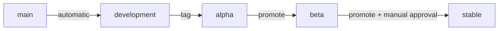

# Release process

!!! note "Not implemented"

    Milestone 8. There has been no release. This documents the intended process so that
    decisions made now — versioning, channels, artifact promotion — are made deliberately
    rather than discovered later.

## Principles

**Promote artifacts, never rebuild them.** A rebuild between beta and stable produces a
different artifact from the one that was tested. Promotion changes metadata; the bytes are
identical and the signature still verifies.

**Every release must migrate existing installations.** Breaking an API before 1.0 is
acceptable. Breaking somebody's server is not.

**Signing keys are not available to ordinary CI.** They live in a manually-approved
environment reachable only by the release workflow.

## Channels

| Channel | Source | Audience |
|---|---|---|
| `development` | Every successful `main` build | Developers |
| `alpha` | Tagged prerelease | Early testers |
| `beta` | Promoted alpha artifact | Hardware testers |
| `stable` | Promoted beta artifact | Everyone else |



## Cutting a release

1. **Confirm the milestone is done** — acceptance criteria met, upgrade matrix green,
   installer CI green, no open `risk/` issues
2. **Update `CHANGELOG.md`** — move Unreleased into a version, record the minimum version
   this can upgrade from
3. **Tag from `main`**, signed:

    ```sh
    git tag -s v0.2.0-alpha.1 -m "Homebase 0.2.0-alpha.1"
    git push origin v0.2.0-alpha.1
    ```

4. **The release workflow builds and signs** — `.deb` packages, installer image, checksums,
   SBOM, provenance attestation
5. **Verify on real hardware** before promoting beyond alpha
6. **Promote** by moving the artifact between channels. Stable requires manual approval

## Artifacts

Every release publishes:

- `homebase-core_<version>_amd64.deb`
- `homebase-hostd_<version>_amd64.deb`
- `homebase-dashboard_<version>_all.deb`
- `homebase-<version>-amd64.iso`
- `SHA256SUMS` and its signature
- SBOM (SPDX or CycloneDX)
- Build provenance attestation
- Application catalogue snapshot

## Release metadata

Each release records the exact commit and component versions, and — the field that matters
operationally — the **minimum version it can upgrade from**:

```yaml
version: 0.2.0
commit: b103c829089cea4e337ea0ba1cd9d3e444c25193
components:
  core: 0.2.0
  hostd: 0.2.0
  dashboard: 0.2.0
  installer: 0.2.0
schema_version: 4
catalogue_version: 3
minimum_upgrade_from: 0.1.0
```

`minimum_upgrade_from` is what lets a machine on an older version be told to take an
intermediate release first, rather than attempting a migration nobody tested.

## Before promoting to stable

- [ ] Upgrade matrix green from the previous stable
- [ ] Installer CI green against blank and Windows-occupied disks
- [ ] Interrupted-update tests pass at every stage
- [ ] Backup and restore verified across machines
- [ ] Tested on at least three physical laptops (Milestone 9 onwards)
- [ ] Signatures verify with a clean keyring
- [ ] Rollback verified from this version to the previous one
- [ ] Changelog accurate; breaking changes state what a user must do

## Hotfixes

Branch from the release branch, fix, release a patch version, and **merge back into `main`
immediately**. A fix living only on a release branch will be lost at the next release.

## See also

- [Versioning](versioning.md)
- [Update security](../security/update-security.md)
- [Changelog](https://github.com/HusnuOkanCakir/homebase/blob/main/CHANGELOG.md)
