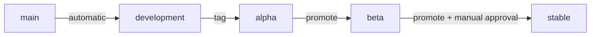

# Release process

!!! note "Built, never yet run for real"

    Milestone 8. The workflows exist — [`release.yml`][release-workflow] builds, signs and
    verifies; [`promote.yml`][promote-workflow] moves an artifact between channels behind a
    manual approval. There has been no release, and **the archive is not hosted anywhere
    yet**: a release produces a signed, verified repository as a build artifact, and serving
    it is a separate decision Milestone 9 has to make.

    The parts that do not need a key or a host are exercised on every pull request. See
    [What is checked continuously](#what-is-checked-continuously).

[release-workflow]: https://github.com/HusnuOkanCakir/homebase/blob/main/.github/workflows/release.yml
[promote-workflow]: https://github.com/HusnuOkanCakir/homebase/blob/main/.github/workflows/promote.yml

## Principles

**Promote artifacts, never rebuild them.** A rebuild between beta and stable produces a
different artifact from the one that was tested. Promotion changes metadata; the bytes are
identical and the signature still verifies.

**Every release must migrate existing installations.** Breaking an API before 1.0 is
acceptable. Breaking somebody's server is not.

**Signing keys are not available to ordinary CI.** They live in a manually-approved
environment reachable only by the release workflow.

## Channels

| Channel | Source | Tag | Audience |
|---|---|---|---|
| `development` | Tagged development build | `v0.2.0-dev.1` | Developers |
| `alpha` | Tagged prerelease | `v0.2.0-alpha.1` | Early testers |
| `beta` | Promoted alpha artifact | `v0.2.0-beta.1` | Hardware testers |
| `stable` | Promoted beta artifact | **no tag** | Everyone else |

**There is no tag that publishes to stable**, and that is enforced rather than written
down: `scripts/release.py` refuses `v0.2.0` with a message saying to tag a beta and promote
it. The rule exists for what somebody might do in a hurry at eleven at night, so a program
holds it rather than a checklist.

`development` is published from a tag too, rather than from every `main` build. Signing on
every commit would mean the archive key — the most valuable secret in the project — was
reachable from the most ordinary event in it.



## Cutting a release

1. **Confirm the milestone is done** — acceptance criteria met, upgrade matrix green,
   installer CI green, no open `risk/` issues
2. **Update `CHANGELOG.md`** — move Unreleased into a version, record the minimum version
   this can upgrade from
3. **Tag from `main`**, signed:

    ```sh
    git tag -s v0.2.0-alpha.1 -m "Homebase 0.2.0-alpha.1"
    git push origin v0.2.0-alpha.1
    ```

4. **The release workflow builds and signs** — `.deb` packages, SBOMs, provenance
   attestations, and a signed archive that is verified before it is published
5. **Verify on real hardware** before promoting beyond alpha
6. **Promote** by running the Promote workflow. Stable requires manual approval

## What the workflows do, and what they deliberately do not

The **build** job has no secrets and no environment. It resolves the tag, builds the
packages, and attests them. Everything it does would be safe to run on any commit, which is
what makes the attestation worth having: the provenance is Sigstore-backed and bound to this
workflow's OIDC identity, so there is no long-lived signing secret behind the strongest
claim about where an artifact came from.

Its dependency caches are **off**, and only there. A poisoned cache on CI costs a wrong test
result; in a release it would be baked into a signed artifact that machines install as root,
and then attested to as having come from this commit.

The **publish** job is the only one that can reach the archive key, and its environment is
the *channel* — so `beta` can require a reviewer while `development` does not. It signs, then
runs `build-repo.py verify`, which reads the finished archive back the way apt will: `gpgv`
against the exported keyring, `Release` against the index, the index against every file in
the pool. That code is not shared with the writer. An archive that is self-consistent and
wrong passes every check made while writing it and fails here.

**Promotion never rebuilds.** `build-repo.py promote` copies the index entry the source
channel recorded, after checking the file on disk still hashes to it. A package rebuilt under
a version that has already been through a channel is refused rather than shipped.

**The manual approval is not a step in the workflow.** It is a GitHub environment protection
rule on the target channel, so it stays in force whatever reaches that environment, and
cannot be removed by editing a workflow file in a pull request.

## What a person has to set up

None of this runs until these exist, and nothing in the repository can create them:

- An **environment per channel** — `development`, `alpha`, `beta`, `stable` — each holding
  `ARCHIVE_SIGNING_KEY`, the ASCII-armoured private key for the archive
- **Required reviewers on `stable`**, and on `beta` if hardware testing is gated
- A **deployment branch rule** on each environment limiting it to tags, so a branch cannot
  reach the signing key

The public half of the key ships inside `homebase-hostd`, under `/usr/share/keyrings/`, and
is what `Signed-By=` pins. Rotating it means shipping a package before the archive it
verifies — see [update security](../security/update-security.md).

## What is checked continuously

The parts that need neither a key nor a host run on every pull request, in `ci/contracts`:
`tests/unit/test_repo.py` builds a real signed archive from four empty `.deb` files and a
throwaway key, then breaks it five ways and checks each break is refused —

- a package rebuilt under a version already published
- an index edited after signing
- an archive signed by a key the shipped keyring does not hold
- a channel offering three of the four packages, which every machine would refuse
- an expired index

It also checks what a tag releases: that `v0.2.0-alpha.1` becomes Debian version
`0.2.0~alpha.1` — with the tilde, so `dpkg` sorts it *before* `0.2.0` rather than after — and
that a tag cannot reach stable.

The only untested part of a real release is therefore the key material and the environment
protection rules.

## Artifacts

Every release publishes:

- `homebase-hostd_<version>_amd64.deb`
- `homebase-core_<version>_amd64.deb`
- `homebase-apps_<version>_all.deb`
- `homebase-dashboard_<version>_all.deb`
- A CycloneDX SBOM per package, read from the linked binary rather than from `go.mod` —
  `homebase-hostd`'s is empty, and the build fails if it ever is not
- Build provenance attestations, bound to each `.deb` by digest
- The signed archive: `dists/<channel>/{Release,InRelease,Release.gpg}`, the index, the pool,
  and the exported public key

Not yet: the installer image, and `SHA256SUMS` — the archive's own `Release` file already
names the SHA-256 of everything in it, under a signature, which is the checksum list that
matters. An `.iso` arrives when installation media is built by CI rather than by
`homebasectl installer create` on a developer's machine.

To check a package came from this repository rather than from somebody's laptop:

```sh
gh attestation verify homebase-core_0.2.0~alpha.1_amd64.deb --repo HusnuOkanCakir/homebase
```

## Release metadata

Each release records the exact commit and component versions, and — the field that matters
operationally — the **minimum version it can upgrade from**:

```yaml
version: 0.2.0
commit: b103c829089cea4e337ea0ba1cd9d3e444c25193
components:
  core: 0.2.0
  hostd: 0.2.0
  dashboard: 0.2.0
  installer: 0.2.0
schema_version: 4
catalogue_version: 3
minimum_upgrade_from: 0.1.0
```

`minimum_upgrade_from` is what lets a machine on an older version be told to take an
intermediate release first, rather than attempting a migration nobody tested.

## Before promoting to stable

- [ ] Upgrade matrix green from the previous stable
- [ ] Installer CI green against blank and Windows-occupied disks
- [ ] Interrupted-update tests pass at every stage
- [ ] Backup and restore verified across machines
- [ ] Tested on at least three physical laptops (Milestone 9 onwards)
- [ ] Signatures verify with a clean keyring
- [ ] Rollback verified from this version to the previous one
- [ ] Changelog accurate; breaking changes state what a user must do

## Hotfixes

Branch from the release branch, fix, release a patch version, and **merge back into `main`
immediately**. A fix living only on a release branch will be lost at the next release.

## See also

- [Versioning](versioning.md)
- [Update security](../security/update-security.md)
- [Changelog](https://github.com/HusnuOkanCakir/homebase/blob/main/CHANGELOG.md)
