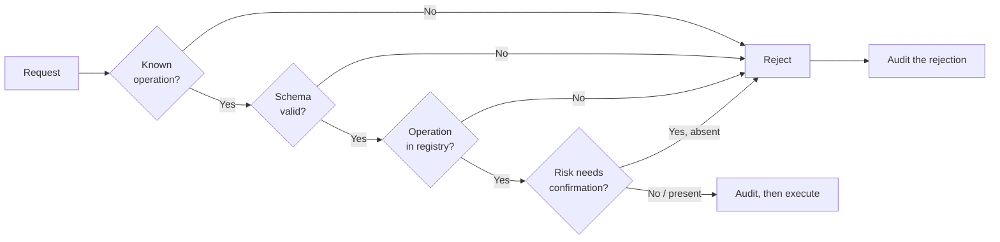

# Privilege boundaries

The operational detail of [ADR-0006](../decisions/0006-privilege-split.md). That record says
what the boundary is and why; this one says how it is enforced and how to tell when it has
been broken.

## The four levels

| Level | Runs as | What it can do |
|---|---|---|
| **Browser / AI operator** | The signed-in user's permissions | Call the `core` API. Nothing else |
| **`core`** | `homebase` | HTTP, database, jobs. Invoke `hostd` operations |
| **`hostd`** | `root`, sandboxed | A fixed set of named operations |
| **Kernel** | — | Everything |

The gap between levels two and three is the one that matters. It is enforced by three
independent mechanisms, and all three must hold:

1. **Unix permissions** on the socket — `root:homebase`, mode `0660`
2. **systemd sandboxing** on both services
3. **Schema validation** in `hostd`, on every request

## The socket

```text
/run/homebase/hostd.sock   root:homebase   srw-rw----   (0660)
```

`core` runs as `homebase`, so it can connect. Application containers do not have the socket
mounted, so they cannot. Other users on the machine are not in the `homebase` group.

**A packaging change that widens this to `0666` removes the boundary entirely, without
touching a line of Go.** That is why `packaging/` is in `CODEOWNERS` under security review,
and why it is worth stating in three separate documents.

Socket activation means `hostd` starts on first connection and `core` can start before it is
ready.

### The socket outlives the service

`hostd`'s unit declares `RuntimeDirectoryPreserve=yes`, and that line is load-bearing rather
than tidy.

systemd removes a `RuntimeDirectory` when its service stops. The socket belongs to
`homebase-hostd.socket`, but it lives inside `homebase-hostd.service`'s runtime directory —
so without that line, stopping `hostd` for a moment deletes the socket, while the socket unit
carries on reporting itself `active (running)` and `Listen: /run/homebase/hostd.sock` against
a path that no longer exists.

Nothing can connect after that, and nothing says so. Every unit looks healthy; the only
symptom is `core` reporting that it cannot reach the part of itself that manages the server,
permanently. **Every upgrade restarts `hostd`,** so this is the ordinary path rather than a
corner of it.

A test in `tests/vm/test_packages.py` restarts `hostd` deliberately and checks the socket is
still there and still works. That check exists because the failure is silent: it cannot be
noticed by looking.

## systemd sandboxing

`hostd` is root, so it gets the tightest confinement that still lets it work:

```ini
[Service]
User=root
NoNewPrivileges=yes
ProtectSystem=strict
ProtectHome=yes
PrivateTmp=yes
ReadWritePaths=/etc/homebase /var/lib/homebase /srv/homebase /run/homebase
RestrictAddressFamilies=AF_UNIX AF_NETLINK
RestrictNamespaces=yes
LockPersonality=yes
MemoryDenyWriteExecute=yes
SystemCallFilter=@system-service
SystemCallArchitectures=native
```

`core` gets everything above plus dropped capabilities and a private user:

```ini
[Service]
User=homebase
Group=homebase
CapabilityBoundingSet=
AmbientCapabilities=
PrivateDevices=yes
ProtectKernelTunables=yes
ProtectKernelModules=yes
ProtectControlGroups=yes
ReadWritePaths=/var/lib/homebase /srv/homebase /var/log/homebase
```

`CapabilityBoundingSet=` empty is the important line: even a `core` that somehow acquires a
setuid binary gains nothing.

These are exact values, and they are part of the security contract rather than performance
tuning. Changing one is a `risk/security` pull request.

## Operations

Every `hostd` operation declares its properties:

```yaml
name: storage.format
risk: critical
permissions: [storage.modify]
confirmation: explicit
timeout: 300s
rollback: none          # Cannot be undone. Stated up front.
audit: always
```

### Risk levels

| Risk | Meaning | Default handling |
|---|---|---|
| `read` | Observes, changes nothing | Runs automatically |
| `low` | Reversible, no data impact | Runs; notifies |
| `medium` | Affects service availability | Confirmation |
| `high` | Can affect user data | Explicit confirmation |
| `critical` | Irreversible data destruction | Explicit confirmation naming the target |

These become the policy engine's input in Stage 2. An AI operator granted "safe actions"
gets `read` and `low`, and nothing above.

### Validation order

Every request, without exception:



**`hostd` does not check the signed-in person's permissions, and this document used to say
it did.** That was wrong, and it is the kind of wrong that matters: somebody reading it would
conclude there are two independent checks on who may reboot the machine, and there is one.

What `hostd` actually verifies, and it is not nothing:

- **Who is connecting** — the peer's user id on the socket, which the kernel supplies and
  nothing on the far side can claim. Anything but `core` is refused before the request is
  read.
- **That the operation exists** — resolved against a registry compiled into the binary.
  There is no generic execution to reach, so a compromised `core` gets the operations that
  were built, not the ones it can compose.
- **That the request has the right shape**, against that operation's own schema.
- **That a dangerous operation carries its confirmation.**
- **And it audits the attempt before running anything**, including the rejections. An attempt
  to invoke something that was refused is exactly what you want a record of.

The permission a `hostd` operation declares is metadata: it is what `core` reads to decide
whether the person asking may ask, and it is published in the operation catalogue. It is not
a second gate inside `hostd`.

So a compromised `core` can invoke any privileged operation that was compiled in. The typed
surface is what limits the damage, and it is a real limit — it is the difference between
"reboot the machine, format a disk" and "run this shell command as root" — but it is not
independent authorisation of the user.

**The fix is not to let `core` send the permissions it believes the caller has.** A
compromised `core` would send whatever it liked, and the check would be theatre with a cost.
Making this real needs a credential `hostd` can verify without trusting the sender — a
short-lived capability issued by something that is not `core` — and that is a design, not a
patch. Until it exists, authorisation lives in `core` and this document says so.

### What the audit log does not record

The audit log holds the parameters of every privileged call, append-only, kept indefinitely.
That was safe on the strength of an invariant: **`hostd` deals in references — an application
id, a disk id, a storage location — never in values anybody would mind seeing.** A password
never reaches it, because `core` stores an argon2id hash and `hostd` is never told one.

`network.wifi_connect` is the first genuine exception. `netplan` needs the Wi-Fi passphrase
itself, and there is no reference form of it. The passphrase went into the log in plain text,
and what found it was a VM test that looked for it there rather than a review that thought
about it.

The fix is a declaration rather than a heuristic. An operation names the request fields that
must never be recorded:

```go
Secret: []string{"passphrase"},
```

and the server replaces them with `"[redacted]"` before the event is written. Three
properties follow:

- **It is part of the operation**, next to the handler, and it appears in `--describe` — so
  the set of operations handling secrets is reviewable in the same place as the set requiring
  confirmation
- **The field is present but hidden**, not removed. "There was a passphrase and it is not
  recorded" and "there was no passphrase" are different facts, and the first is the one
  somebody reconstructing an incident needs
- **`scripts/check_operations.py` enforces it in both directions**: an operation known to take
  a secret must declare it, and an operation that declares one must be listed in that file —
  so adding a secret means changing a file whose only purpose is to be read in review

A body that does not parse as a JSON object is dropped rather than recorded. If the shape is
not what it should be, nothing knows what is in it.

## How to tell the boundary has been broken

Warning signs in a pull request, roughly in order of severity:

1. **A `hostd` operation taking a command, path, or configuration fragment as a parameter.**
   This is the boundary, stated directly
2. **An operation whose parameter is used to build a shell command**, however carefully
   escaped
3. **Dynamic operation dispatch** — resolving a name at runtime rather than from a
   compiled-in set
4. **`core` opening the Docker socket, or any privileged file descriptor**
5. **Socket permissions widened** in packaging
6. **A systemd hardening directive removed** to make something work
7. **An operation added without a risk level, rollback consideration or audit record**
8. **Validation skipped** on the grounds that the caller is trusted

Any of these makes it a `risk/security` pull request requiring security review.

## The Stage 2 chain

When the AI operator arrives, one more link is added — outside the privileged path, not
inside it:

```text
Model proposes  →  Policy engine decides  →  Capability performs  →  Audit records
   (untrusted)        (core, unprivileged)     (hostd, typed)         (append-only)
```

The model's output is **data, not instruction**. It is a proposal to be evaluated, in exactly
the same way a request from the dashboard is evaluated.

Three rules follow, and they are not negotiable:

- The model never receives a secret. It receives `credential_ref: "jellyfin-admin"`
- The model never bypasses the policy engine, including when it is right and the policy is
  being obtuse
- The model's confidence carries no weight. A proposal is evaluated on what it would do, not
  on how sure the model is

A system where a sufficiently confident model can act directly is a system where a
sufficiently well-crafted filename can act directly.

## See also

- [ADR-0006](../decisions/0006-privilege-split.md) — the decision and its alternatives
- [Threat model](threat-model.md) — what this defends against, and what it does not
- [Services](../architecture/services.md) — per-component "must not" lists
