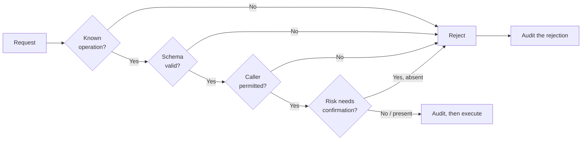

# Privilege boundaries

The operational detail of [ADR-0006](../decisions/0006-privilege-split.md). That record says
what the boundary is and why; this one says how it is enforced and how to tell when it has
been broken.

## The four levels

| Level | Runs as | What it can do |
|---|---|---|
| **Browser / AI operator** | The signed-in user's permissions | Call the `core` API. Nothing else |
| **`core`** | `homebase` | HTTP, database, jobs. Invoke `hostd` operations |
| **`hostd`** | `root`, sandboxed | A fixed set of named operations |
| **Kernel** | — | Everything |

The gap between levels two and three is the one that matters. It is enforced by three
independent mechanisms, and all three must hold:

1. **Unix permissions** on the socket — `root:homebase`, mode `0660`
2. **systemd sandboxing** on both services
3. **Schema validation** in `hostd`, on every request

## The socket

```text
/run/homebase/hostd.sock   root:homebase   srw-rw----   (0660)
```

`core` runs as `homebase`, so it can connect. Application containers do not have the socket
mounted, so they cannot. Other users on the machine are not in the `homebase` group.

**A packaging change that widens this to `0666` removes the boundary entirely, without
touching a line of Go.** That is why `packaging/` is in `CODEOWNERS` under security review,
and why it is worth stating in three separate documents.

Socket activation means `hostd` starts on first connection and `core` can start before it is
ready.

## systemd sandboxing

`hostd` is root, so it gets the tightest confinement that still lets it work:

```ini
[Service]
User=root
NoNewPrivileges=yes
ProtectSystem=strict
ProtectHome=yes
PrivateTmp=yes
ReadWritePaths=/etc/homebase /var/lib/homebase /srv/homebase /run/homebase
RestrictAddressFamilies=AF_UNIX AF_NETLINK
RestrictNamespaces=yes
LockPersonality=yes
MemoryDenyWriteExecute=yes
SystemCallFilter=@system-service
SystemCallArchitectures=native
```

`core` gets everything above plus dropped capabilities and a private user:

```ini
[Service]
User=homebase
Group=homebase
CapabilityBoundingSet=
AmbientCapabilities=
PrivateDevices=yes
ProtectKernelTunables=yes
ProtectKernelModules=yes
ProtectControlGroups=yes
ReadWritePaths=/var/lib/homebase /srv/homebase /var/log/homebase
```

`CapabilityBoundingSet=` empty is the important line: even a `core` that somehow acquires a
setuid binary gains nothing.

These are exact values, and they are part of the security contract rather than performance
tuning. Changing one is a `risk/security` pull request.

## Operations

Every `hostd` operation declares its properties:

```yaml
name: storage.format
risk: critical
permissions: [storage.modify]
confirmation: explicit
timeout: 300s
rollback: none          # Cannot be undone. Stated up front.
audit: always
```

### Risk levels

| Risk | Meaning | Default handling |
|---|---|---|
| `read` | Observes, changes nothing | Runs automatically |
| `low` | Reversible, no data impact | Runs; notifies |
| `medium` | Affects service availability | Confirmation |
| `high` | Can affect user data | Explicit confirmation |
| `critical` | Irreversible data destruction | Explicit confirmation naming the target |

These become the policy engine's input in Stage 2. An AI operator granted "safe actions"
gets `read` and `low`, and nothing above.

### Validation order

Every request, without exception:



`hostd` re-checks permissions even though `core` already did. Not redundancy for its own
sake: `core` is the component most likely to be compromised, because it is the one talking to
the network.

Rejections are audited too. An attempt to invoke something not permitted is exactly what you
want a record of.

## How to tell the boundary has been broken

Warning signs in a pull request, roughly in order of severity:

1. **A `hostd` operation taking a command, path, or configuration fragment as a parameter.**
   This is the boundary, stated directly
2. **An operation whose parameter is used to build a shell command**, however carefully
   escaped
3. **Dynamic operation dispatch** — resolving a name at runtime rather than from a
   compiled-in set
4. **`core` opening the Docker socket, or any privileged file descriptor**
5. **Socket permissions widened** in packaging
6. **A systemd hardening directive removed** to make something work
7. **An operation added without a risk level, rollback consideration or audit record**
8. **Validation skipped** on the grounds that the caller is trusted

Any of these makes it a `risk/security` pull request requiring security review.

## The Stage 2 chain

When the AI operator arrives, one more link is added — outside the privileged path, not
inside it:

```text
Model proposes  →  Policy engine decides  →  Capability performs  →  Audit records
   (untrusted)        (core, unprivileged)     (hostd, typed)         (append-only)
```

The model's output is **data, not instruction**. It is a proposal to be evaluated, in exactly
the same way a request from the dashboard is evaluated.

Three rules follow, and they are not negotiable:

- The model never receives a secret. It receives `credential_ref: "jellyfin-admin"`
- The model never bypasses the policy engine, including when it is right and the policy is
  being obtuse
- The model's confidence carries no weight. A proposal is evaluated on what it would do, not
  on how sure the model is

A system where a sufficiently confident model can act directly is a system where a
sufficiently well-crafted filename can act directly.

## See also

- [ADR-0006](../decisions/0006-privilege-split.md) — the decision and its alternatives
- [Threat model](threat-model.md) — what this defends against, and what it does not
- [Services](../architecture/services.md) — per-component "must not" lists
