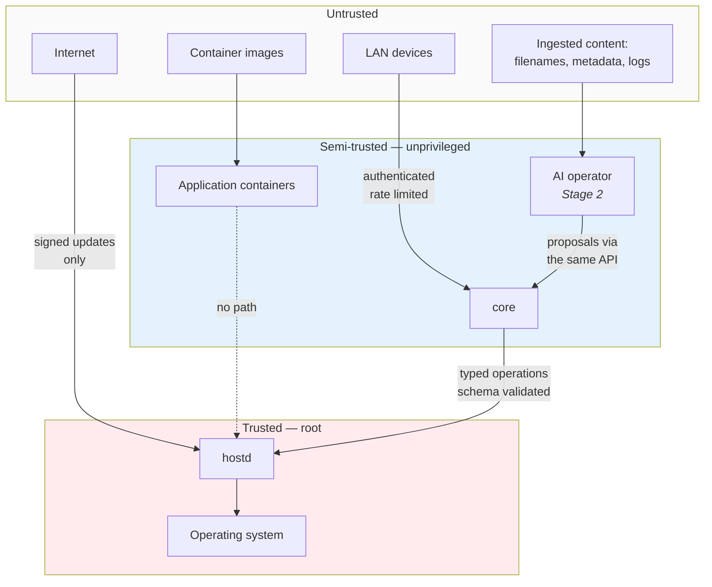

# Threat model

What Homebase defends against, what it does not, and why.

The second list matters more than the first. A threat model that claims to defend against
everything tells a user nothing about the risks they are actually taking.

!!! note "Pre-alpha"

    This describes the intended design. Most of it is not implemented — see the
    [roadmap](https://github.com/HusnuOkanCakir/homebase/blob/main/ROADMAP.md). Where
    implementation and this document disagree, this document is the target and the gap is
    a bug.

## What is being protected

| Asset | Why it matters | Worst case |
|---|---|---|
| **User data** in `/srv/homebase/` | Often the only copy — family photographs, documents | Irreversible loss |
| **Credentials** in the secrets store | Application admin passwords, API tokens | Lateral movement, account takeover |
| **The update channel** | Reaches every installation | Mass compromise |
| **System state** in `/var/lib/homebase/` | Sessions, audit log, configuration | Session theft, audit forgery |
| **The machine itself** | Sits on a home network with everything else | Pivot to other devices |
| **Availability** | People rely on it for photos and media | Loss of access, no data loss |

User data is first for a reason. Every other compromise on this list can be recovered from.

## Adversaries

### A hostile device on the LAN

**Assume this is normal.** A home network contains a smart television with unpatched
firmware, a guest's laptop, a doorbell camera. Homebase must not assume the LAN is trusted.

Defended by: authentication on every endpoint including on the LAN; no unauthenticated
service beyond mDNS discovery; local HTTPS; no default credentials — first-run setup requires
creating an administrator.

Rate limiting is per client address on the three endpoints that verify an argon2id hash —
sign in, first-run setup and recovery. Each costs 64 MiB by design and none needs a
credential to reach, so the limit is there to bound memory as much as to slow guessing.
Concurrent hashing is capped independently, because a limiter keyed on address does not help
against many addresses. Successful attempts are refunded: rationing correct sign-ins would
punish the household rather than the attacker.

### A malicious or compromised application image

The user installs Jellyfin; the image is later compromised upstream.

Defended by: a curated catalogue rather than arbitrary images; declared minimal permissions —
no privileged mode, capabilities dropped, read-only root filesystem where possible; per-app
storage isolation; no application access to the `hostd` socket.

**Not fully defended.** Containers are not a strong security boundary and Docker's daemon is
root ([ADR-0005](../decisions/0005-container-runtime.md)). A container escape is a host
compromise. This is the largest accepted risk in the design.

### An attacker who compromises `core`

The plausible route in, since `core` handles network requests.

Defended by [ADR-0006](../decisions/0006-privilege-split.md): `core` is unprivileged, has no
Docker socket, and can invoke only the typed operations `hostd` exposes. There is no path
from compromising `core` to a shell.

What they still get: everything `core` legitimately does — reading application configuration,
invoking permitted operations, reading the database including sessions.

### A compromised update channel

The highest-impact adversary, because it reaches every installation at once.

Defended by: signed artifacts with client-side verification; downgrade protection; signing
keys unavailable to ordinary CI jobs; manual approval for stable promotion; the same artifact
promoted through channels rather than rebuilt. See [update security](update-security.md).

### A compromised dependency or CI

Supply chain, in both directions.

Defended by: every action pinned to a commit SHA; `zizmor` and a grep check to keep it that
way; Dependabot; `dependency-review` failing on moderate severity; no secrets exposed to fork
pull requests; `pull_request_target` never used; no self-hosted runners. See
[CI security](ci-security.md).

### Prompt injection — Stage 2

Untrusted content reaching the AI operator: a filename, a media title, a document, an
application description, a log line from a third-party container.

**Assume this will happen.** A home server ingests untrusted text continuously; there is no
version of this where the model only reads what the user typed.

Defended architecturally, not by prompting: the model proposes an intention, a policy engine
decides, a typed capability performs, the audit log records. A successful injection produces
a *proposal*, which is then evaluated on its own merits — an injected "delete all backups"
faces the same confirmation requirement as a user-typed one.

The model never receives secrets, only credential references.

### An attacker with physical access

**Explicitly out of scope.**

Homebase installs by erasing a whole disk and assumes a physically trusted machine. Full-disk
encryption is not implemented, so an attacker holding the drive reads everything: user data,
the secrets store, sessions.

This is a real limitation, documented rather than defended. A server in a shared house or an
office is exposed to it. Full-disk encryption is not on the roadmap before 1.0, principally
because unattended boot with encryption requires either a TPM flow or a passphrase at every
boot — and "your server did not come back after the power cut because it wants a password"
is its own kind of failure for the target user.

## Trust boundaries

The two boundaries that carry the weight:

**LAN → `core`** — everything crossing it is authenticated, authorised and rate limited.

**`core` → `hostd`** — everything crossing it is one of a fixed set of named operations,
schema-validated, risk-classified and audited. This is the one that makes the rest
survivable.

Note that the AI operator sits in the *semi-trusted* box, alongside application containers.
That placement is the whole point.

## Accepted risks

Stated plainly, because a threat model that hides its compromises is marketing.

| Risk | Why accepted | Mitigation |
|---|---|---|
| **No full-disk encryption** | Unattended boot needs TPM or a passphrase; both fail badly for the target user | Physical access declared out of scope |
| **Docker daemon runs as root** | Rootless Podman's rough edges land where we cannot afford them | Only `hostd` reaches the socket; minimal app permissions |
| **Container escape is host compromise** | Inherent to the runtime | Curated catalogue; minimal permissions |
| **`hostd` bugs are full compromise** | It must be privileged to do its job | Kept small, few dependencies, security review, memory-safe language |
| **Single maintainer reviews security changes** | The project has one maintainer | Required CI checks; approvals go to 1 when a second joins |
| **No hash pinning in `requirements-dev.txt`** | Milestone 0 tooling only, not shipped | Dependabot; scheduled for Milestone 8 |
| **The recovery code is a bearer credential on paper that never expires** | The alternative is a user permanently locked out of their own photographs, which is both worse and far likelier than a household adversary finding the paper | 125 bits; argon2id at rest; single use; rate limited; using it destroys every session and raises a non-recoverable event ([ADR-0015](../decisions/0015-password-recovery.md)) |
| **A backup disk plus a written recovery code is complete access to the server** | Both must survive the machine to be worth anything, and encrypting either moves the failure to a key the user has lost | Stated in the backup README, the user guide and the manifest — keep them in different places |

## What is out of scope

- **Physical access**, as above
- **Nation-state adversaries.** Homebase is not a hardened appliance and does not claim to be
- **Denial of service by an authenticated administrator.** They can reboot the machine
- **Vulnerabilities in catalogued third-party applications.** Report those upstream; tell us
  if our manifest makes an upstream issue worse
- **The user's own network security.** Homebase defends itself on a hostile LAN; it does not
  secure the LAN
- **Public internet exposure.** Not supported. Remote access is private (Tailscale) or
  nothing

## Reporting

See [SECURITY.md](https://github.com/HusnuOkanCakir/homebase/blob/main/SECURITY.md). Report
privately, never in a public issue.

Reports showing the `core` → `hostd` boundary crossed, or the Stage 2 proposal-policy-capability
chain broken, are the most valuable thing we can receive.
