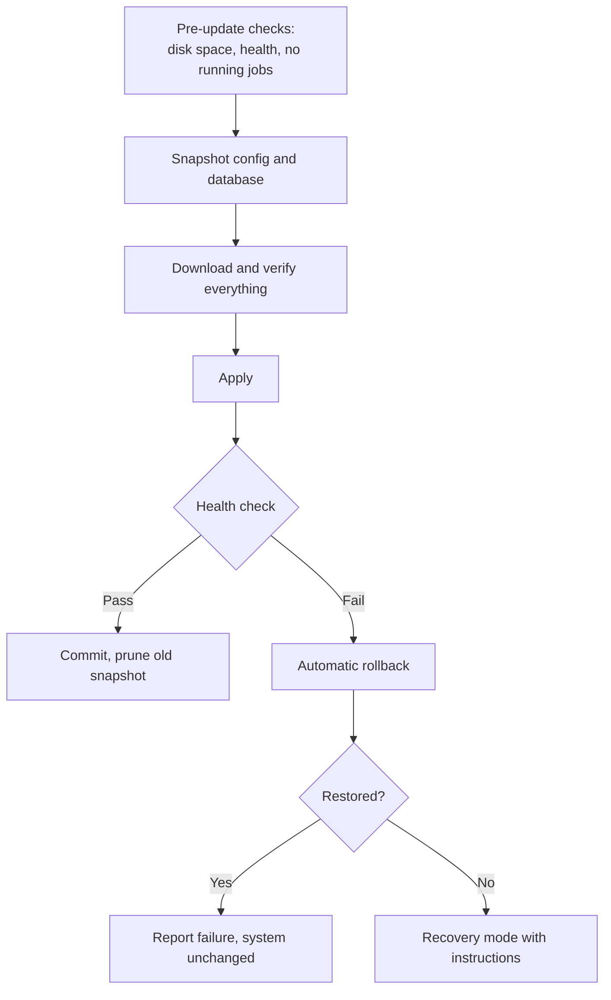

# Update security

An automatic update system is a remote code execution channel that the user has agreed to.
Compromising it reaches every installation at once, which makes it the highest-impact target
in the project — higher than `hostd`, because `hostd` compromises one machine.

!!! note "Not implemented"

    This describes the design for Milestone 8. Nothing here exists yet.

## Requirements

1. **Artifacts are signed**, and clients verify signatures before installing anything
2. **Downgrades are refused** unless explicitly requested by the user
3. **Signing keys are unavailable to ordinary CI jobs**
4. **The same artifact is promoted** through channels — never rebuilt
5. **An interrupted update leaves a bootable machine** with intact data
6. **Recovery works offline**, when the update server is unreachable or hostile

## Channels

| Channel | Source | Audience |
|---|---|---|
| `development` | Every successful `main` build | Developers |
| `alpha` | Tagged prerelease | Early testers |
| `beta` | Promoted alpha artifact | Hardware testers |
| `stable` | Promoted beta artifact | Everyone else |

**Promotion moves the artifact, it does not rebuild it.** A rebuild between beta and stable
produces a different artifact from the one that was tested, which means stable ships
something nobody ran. Promotion changes metadata; the bytes are identical and the signature
still verifies.

Stable promotion requires manual approval through a GitHub environment, so a compromised
workflow cannot promote to stable on its own.

## Signing

Release artifacts are signed with a key that ordinary CI jobs cannot reach:

- Held in a GitHub environment gated by manual approval
- Only the release workflow can request it
- Fork pull requests never see it, by construction
- Rotation is documented, and old keys stay valid for verification

Every release publishes:

- Signed `.deb` packages and installer image
- SHA-256 checksums for each artifact
- An SBOM in CycloneDX — **built** ✅
- Build provenance attestation

**The SBOM is read from the linked binary**, with `go version -m`, rather than from `go.mod`.
`go.mod` lists what was asked for; `go list -m all` includes modules needed to build and test
but never linked. An SBOM that overstates what is in an artifact is nearly as unhelpful as one
that understates it — every advisory becomes a false alarm, and false alarms are how people
stop reading them.

It also enforces something. `homebase-hostd`'s bill of materials must be **empty**: the
privileged service carries no third-party code ([ADR-0002](../decisions/0002-implementation-languages.md)),
and the build fails if it ever does. CI already checks `go.mod`; this checks the artifact
somebody actually runs, which is where a dependency arriving through a transitive path would
show up.

Each SBOM travels beside the `.deb` it describes, in the pool rather than in the index, so
anybody holding an artifact can fetch the bill of materials for exactly those bytes. "What is
in Homebase 0.9.0?" is not answerable without knowing *which* 0.9.0.

## Client verification

Before installing anything, `hostd`:

1. Verifies the signature on the update metadata
2. Checks the version is **not older** than what is installed
3. Downloads artifacts and verifies checksums against the signed metadata
4. Verifies each artifact's own signature
5. Refuses everything on any mismatch, loudly

A failure is a security event: reported to the user, recorded in the audit log, and not
retried silently. "Update failed, retrying" is the wrong response to a signature mismatch.

## Downgrade protection

An attacker who can serve old-but-validly-signed artifacts can force a machine back to a
version with a known vulnerability. Signature verification alone does not stop this — the old
signature is genuine.

Mitigations: refuse any version lower than what is installed unless a user explicitly asks
for a rollback; update metadata carries an expiry, so a stale snapshot cannot be replayed
indefinitely; each release states the minimum version it can upgrade from.

## Interrupted updates

Power loss during an update is expected, not exceptional — this runs on a laptop in a
cupboard.

Everything is downloaded and verified **before** anything is applied. An update that fails
part-way through downloading has changed nothing.

The upgrade CI matrix interrupts at each distinct stage and asserts the machine still boots
and its application data is intact. This is not an optional test — it is the one that decides
whether the update system is fit to ship.

## What could still go wrong

Honestly:

- **A compromised signing key.** Rotation is documented; a full TUF implementation with
  threshold signing and key revocation would be the proper answer, and is not planned before
  1.0
- **A compromised build pipeline** could sign a malicious artifact. Provenance attestation
  helps detect it after the fact; it does not prevent it
- **A malicious maintainer.** The project has one maintainer. This is not defended against,
  and could not honestly be claimed otherwise
- **Metadata replay within the expiry window.** Bounded by expiry, not eliminated

## Recovery without the network

If the update server is unreachable, hostile, or the update broke networking, the user must
still be able to recover:

- Roll back to the previous version from local snapshots, with no network
- Reinstall from USB media while preserving `/srv/homebase/`
- A local recovery console reachable without the dashboard

An update system whose recovery path requires the update system is not a recovery path.

## See also

- [Threat model](threat-model.md#a-compromised-update-channel)
- [CI security](ci-security.md)
- [Release process](../release/process.md)
